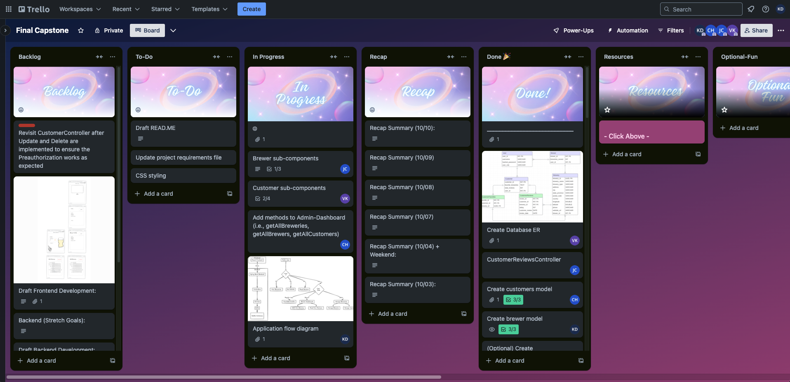
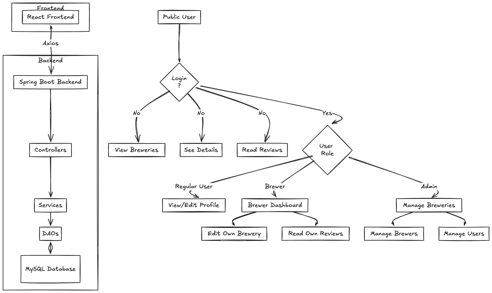
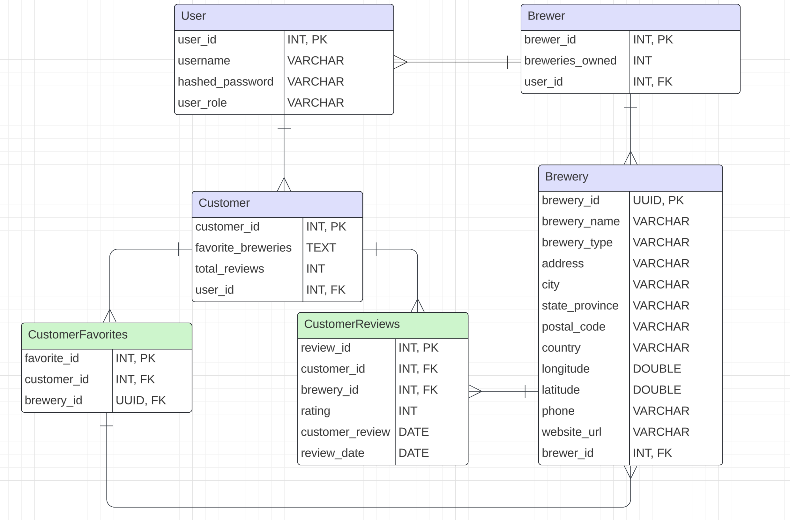

# getTapped - Brewery Finder

**getTapped** is your ultimate brewery finder. Whether you're a beer enthusiast or just starting your brewery journey, getTapped helps you discover the best breweries, craft beers, and experiences across the country.

## Project Design

**Design Tools:**

We used **excalidraw** for visualizing the app’s architecture, data flow, and user interactions. It allowed us to clearly define relationships between components and the data structure. Screenshots of our design diagrams can be found below.

**Project Management:**

We used **Trello** to manage the flow of our project. It helped track tasks across multiple stages, such as “To Do,” “In Progress,” and “Completed.” Trello also provided a collaborative space for assigning tasks, setting deadlines, and organizing the backlog.

- **Task Tracking**: We used a simple Kanban board in Trello to track tasks and deadlines.
- **Collaboration**: Allowed real-time updates and commenting to streamline the development process.

**Diagrams:**
Here are some screenshots of the diagrams used for planning the architecture and flow of the application:

 **Application Flow Diagram**  
   
   
   **Database Schema**  
   
## Front End

The Front End is the face of the **getTapped** application and how users will interact with the brewery finder and reviews. It was built using **React** with **TypeScript**, styled using **CSS** and **Bootstrap**, and managed state with **Context API**.

#### Application Flow:
The user starts at the **Home Page**, where they are greeted with a hero image and an introduction to the purpose of **getTapped**. Users can either explore breweries directly from the home page or log in to access personalized features, such as leaving reviews or managing breweries.

- **Home Page**: This page provides users with an introduction to **getTapped**, showcasing a search option and a hero image. It’s the entry point where users can navigate to view all breweries or log in.
  
- **Brewery List**: Once users click to explore breweries, they are taken to the **Brewery List** page. This page presents a grid of brewery cards, each providing a summary of the brewery name, location, and a link to view more details.
  
- **Brewery Details**: When a brewery is selected, users are navigated to the **Brewery Details** page. Here, they can view all the brewery details such as address, phone number, and available craft beers. Below the brewery information, a list of reviews is presented in a carousel format.

- **Customer Profile**: Logged-in users can access their **Customer Profile**, which includes personal details and the ability to view their reviews. Users can see the breweries they’ve visited, the ratings they’ve provided, and can update or delete reviews.

- **Brewer Dashboard**: For users with the `ROLE_BREWER`, a **Brewer Dashboard** is provided. This dashboard allows brewers to manage their own breweries, including adding new ones, editing existing brewery information, or viewing customer reviews of their brewery.

- **Admin Dashboard**: Admin users have access to an **Admin Dashboard** where they can manage all breweries and brewers, including adding, editing, and removing brewery information.

#### Design Decisions:

We aimed for a clean and responsive design that emphasizes ease of use and accessibility. Here are some key design decisions:
  
- **Responsive Design**: We implemented **flexbox** and **media queries** to ensure that the website is fully responsive and adjusts seamlessly across devices, maintaining a consistent look and feel on desktops, tablets, and mobile phones.
  
- **Consistent UI Elements**: We maintained consistent button styles and typography across the entire site, using **Bootstrap** components for buttons, forms, and cards, but customized to fit the theme of the site.
  
- **Hero Sections**: The hero sections (e.g., on the Home and Brewery List pages) feature large images with text overlay, introducing users to the purpose of each page.

- **Card-Based Layout**: For the list of breweries, we opted for a card-based layout that provides brewery details at a glance and adds depth and interactivity through hover effects.

- **Customer Profile Management**: The **Customer Profile** is designed to offer users a clear view of their brewery experiences, showing a list of reviews they’ve written. This profile page features card elements to display reviews, making it easy to navigate and manage.

- **Brewer Dashboard**: Brewers have an intuitive dashboard interface where they can view all the breweries they manage. The dashboard is equipped with forms for adding or updating breweries and provides real-time feedback on updates.

## Development Stack

#### **Frontend:**
- **React**: For building the user interface with components, hooks, and context API.
- **TypeScript**: Provides type safety and better development experience.
- **React Router**: For client-side routing and navigation between pages.
- **CSS**: Custom styling along with media queries for responsive design.
- **Bootstrap**: Predefined responsive UI elements for forms, buttons, and grids.

#### **Backend:**
- **Java (Spring Boot)**: The backend framework for REST API development.
  - **Spring Security**: Used for authentication and authorization mechanisms.
  - **Spring Data JPA**: For interacting with the database using the Data Access Object (DAO) pattern.

#### **Database:**
- **MySQL**: Relational database used for storing brewery, review, and user data.

#### **API & Data Handling:**
- **Axios**: For making HTTP requests from the React frontend to the Spring Boot backend.
- **REST API**: Follows REST principles for client-server communication, with endpoints for CRUD operations.

#### **Development Tools:**
- **Vite**: Build tool and development server for the React app.
## Database Design
We based our database structure on a brewery API, which served as inspiration for the types of data required in the breweries table. The table uses UUIDs as the primary key, following industry standards, while other tables use auto-incremented integers for their primary keys. This mix required some adjustment, as our bootcamp primarily used integer IDs. Since it was difficult to find APIs that matched all the data we needed, we created fictitious data for other tables, ensuring consistency with the brewery data structure while meeting the needs of different user types.

## API Architecture

The **getTapped** application follows a layered architecture to keep the code modular, maintainable, and scalable. The main layers of the application include **Controllers**, **Services**, and **Repositories** (DAOs). This architecture ensures a clear separation of concerns, where each layer has its own responsibility.

#### Flow of API Requests:

  - **Client Request**: The client (frontend) makes an HTTP request to a specific API endpoint via **Axios** calls. These requests can range from fetching all breweries, posting a new review, or retrieving a specific brewery's details.
   
 - **Controllers**: The controllers handle incoming HTTP requests. They are responsible for routing requests to the correct service methods. Each controller corresponds to a specific resource, such as breweries or customer reviews.

 - **Services**: The service layer contains the business logic of the application. The controllers delegate tasks to services, which are responsible for interacting with the DAOs and applying any business rules.

 - **Repositories (DAOs)**: The Data Access Objects (DAOs) interact with the database. They execute queries to perform CRUD operations (Create, Read, Update, Delete) on the application's data. This layer isolates database interaction logic from the rest of the application.

- **Database**: The **MySQL** database is the core of the persistence layer, where all brewery, review, customer, and brewer data is stored.

## Favorite Code

#### **Charletta's** favorite block of code:

#### **Jessy's** favorite block of code:

#### **Valerie's** favorite block of code:

#### **Karen's** favorite block of code:

## Challenges

**Charletta:**

**Jessy:**

**Valerie:**

**Karen:**