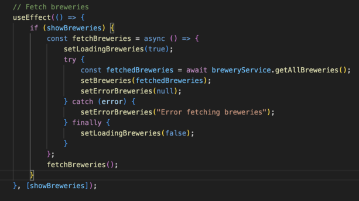

# getTapped - Brewery Finder

**getTapped** is your ultimate brewery finder. Whether you're a beer enthusiast or just starting your brewery journey, getTapped helps you discover the best breweries, craft beers, and experiences across the country.

## Project Design

**Design Tools:**

We used **excalidraw** for visualizing the app’s architecture, data flow, and user interactions. It allowed us to clearly define relationships between components and the data structure. Screenshots of our design diagrams can be found below.

**Project Management:**

We used **Trello** to manage the flow of our project. It helped track tasks across multiple stages, such as “To Do,” “In Progress,” and “Completed.” Trello also provided a collaborative space for assigning tasks, setting deadlines, and organizing the backlog.

- **Task Tracking**: We used a simple Kanban board in Trello to track tasks and deadlines.
- **Collaboration**: Allowed real-time updates and commenting to streamline the development process.

**Diagrams:**
Here are some screenshots of the diagrams used for planning the architecture and flow of the application:

 **Application Flow Diagram**  
   
   
   **Database Schema**  
   

## Front End

The Front End is the face of the **getTapped** application and how users will interact with the brewery finder and reviews. It was built using **React** with **TypeScript**, styled using **CSS** and **Bootstrap**, and managed state with **Context API**.

#### Application Flow:
The user starts at the **Home Page**, where they are greeted with a hero image and an introduction to the purpose of **getTapped**. Users can either explore breweries directly from the home page or log in to access personalized features, such as leaving reviews or managing breweries.

- **Home Page**: This page provides users with an introduction to **getTapped**, showcasing a search option and a hero image. It’s the entry point where users can navigate to view all breweries or log in.
  
- **Brewery List**: Once users click to explore breweries, they are taken to the **Brewery List** page. This page presents a grid of brewery cards, each providing a summary of the brewery name, location, and a link to view more details.
  
- **Brewery Details**: When a brewery is selected, users are navigated to the **Brewery Details** page. Here, they can view all the brewery details such as address, phone number, and available craft beers. Below the brewery information, a list of reviews is presented in a carousel format.

- **Customer Profile**: Logged-in users can access their **Customer Profile**, which includes personal details and the ability to view their reviews. Users can see the breweries they’ve visited, the ratings they’ve provided, and can update or delete reviews.

- **Brewer Dashboard**: For users with the `ROLE_BREWER`, a **Brewer Dashboard** is provided. This dashboard allows brewers to manage their own breweries, including adding new ones, editing existing brewery information, or viewing customer reviews of their brewery.

- **Admin Dashboard**: Admin users have access to an **Admin Dashboard** where they can manage all breweries and brewers, including adding, editing, and removing brewery information.

#### Design Decisions:

We aimed for a clean and responsive design that emphasizes ease of use and accessibility. Here are some key design decisions:
  
- **Responsive Design**: We implemented **flexbox** and **media queries** to ensure that the website is fully responsive and adjusts seamlessly across devices, maintaining a consistent look and feel on desktops, tablets, and mobile phones.
  
- **Consistent UI Elements**: We maintained consistent button styles and typography across the entire site, using **Bootstrap** components for buttons, forms, and cards, but customized to fit the theme of the site.
  
- **Hero Sections**: The hero sections (e.g., on the Home and Brewery List pages) feature large images with text overlay, introducing users to the purpose of each page.

- **Card-Based Layout**: For the list of breweries, we opted for a card-based layout that provides brewery details at a glance and adds depth and interactivity through hover effects.

- **Customer Profile Management**: The **Customer Profile** is designed to offer users a clear view of their brewery experiences, showing a list of reviews they’ve written. This profile page features card elements to display reviews, making it easy to navigate and manage.

- **Brewer Dashboard**: Brewers have an intuitive dashboard interface where they can view all the breweries they manage. The dashboard is equipped with forms for adding or updating breweries and provides real-time feedback on updates.

**App Design**  

## Development Stack

#### **Frontend:**
- **React**: For building the user interface with components, hooks, context API, and event handling with useState and useEffect. Additional React libraries were imported to enhance the user experience, such as a carousel component and built-in React icons.
- **TypeScript**: Provides type safety and better development experience.
- **React Router**: For client-side routing and navigation between pages.
- **CSS**: Custom styling along with media queries for responsive design.
- **Bootstrap**: Predefined responsive UI elements for forms, buttons, and grids.

#### **Backend:**
- **Java (Spring Boot)**: The backend framework for REST API development.
  - **Spring Security**: Used for authentication and authorization mechanisms.
  - **Spring Data JPA**: For interacting with the database using the Data Access Object (DAO) pattern.

#### **Database:**
- **MySQL**: Relational database used for storing brewery, brewer, review, customer, and user data.

#### **API & Data Handling:**
- **Axios**: For making HTTP requests from the React frontend to the Spring Boot backend.
- **REST API**: Follows REST principles for client-server communication, with endpoints for CRUD operations.

#### **Development Tools:**
- **Vite**: Build tool and development server for the React app.
## Database Design
We structured our database around the OpenBreweryDB API, using it as a reference for the attributes in our breweries table. The table utilizes UUIDs as the primary key, aligning with industry standards, while we opted for auto-incrementing integers for the other tables, reflecting the integer IDs we primarily worked with during the bootcamp. Since it was challenging to find APIs that provided all the necessary data, we generated fictitious data for the remaining tables. This allowed us to focus on applying the technologies we learned and demonstrating our full-stack development capabilities

## API Architecture

The **getTapped** application follows a layered architecture to keep the code modular, maintainable, and scalable. The main layers of the application include **Controllers**, **Services**, and **Repositories** (DAOs). This architecture ensures a clear separation of concerns, where each layer has its own responsibility.

#### Flow of API Requests:

  - **Client Request**: The client (frontend) makes an HTTP request to a specific API endpoint via **Axios** calls. These requests can range from fetching all breweries, posting a new review, or retrieving a specific brewery's details.
   
 - **Controllers**: The controllers handle incoming HTTP requests. They are responsible for routing requests to the correct service methods. Each controller corresponds to a specific resource, such as breweries or customer reviews.

 - **Services**: The service layer contains the business logic of the application. The controllers delegate tasks to services, which are responsible for interacting with the DAOs and applying any business rules.

 - **Repositories (DAOs)**: The Data Access Objects (DAOs) interact with the database. They execute queries to perform CRUD operations (Create, Read, Update, Delete) on the application's data. This layer isolates database interaction logic from the rest of the application.

- **Database**: The **MySQL** database is the core of the persistence layer, where all brewery, review, customer, and brewer data is stored.

## Favorite Code

#### **Charletta's** favorite block of code:

#### **Jessy's** favorite block of code:
Although this the whole component, it’s my absolute favorite part about this project. Over the last two weeks of using react, I had yet to implement an edit function and it was always left as a stretch goal on our daily exercises. I made attempts but either didn’t have time to finish or was unable to get it working so this was the FIRST time I was successful! It took me a while to figure out the bugs but it was also the first mapping other than Get that I was able to implement on this project

#### **Valerie's** favorite block of code:
My favorite block of code involves displaying customer review data. While it may seem straightforward at a glance, it required pulling data from multiple tables in our SQL database, meaning the data had to pass through various layers. It had to be integrated into the model and service on the backend, transferred through an interface, and finally injected into the frontend for display. Successfully rendering the data on the page demonstrated not only my understanding of the bootcamp’s key concepts but also the successful design of the database. I was also able to utilize React libraries, which allowed me to easily reformat dates, include icons, and easily helped me visualize customer ratings. All of these factors helped me create a more user-friendly experience.

#### **Karen's** favorite block of code:
This code block is my favorite because it captures a key moment in the project where I implemented a solution to fetch and render reviews for each brewery using a ReviewService. It highlights my ability to solve complex issues by dynamically fetching data and managing state effectively in React. This approach ensured that the reviews were correctly tied to each brewery, creating a seamless user experience. This block also represents a point where I overcame a significant challenge

## Challenges

**Charletta:**
Setting up the AdminContext and AdminContextProvider was a challenge, particularly when integrating them with services to manage data fetching and interactions between the backend API and the front end. I needed to ensure that these contexts effectively managed data for brewers, breweries, and customers.

**Jessy:**
My biggest challenge was with being able to add new breweries within the brewer dashboard, there were two major issues that needed to be handled on both the front and back end. In the back end I had to do some digging through the controllers and DAO to fix a 500 error I was receiving. I knew the issue was there because when I tried to the api call from postman it failed, meaning at least for now, the issues was not within our react project services or contexts. When I looked through the code, I found that we were passing too many values in our MySql script and there were also too many parameters within the prepared statment. Once I fixed that, I was able to move on to the next error: how react was handling the longitude and latitude double variables. I tried a few things to mitigate the issue and realized that the way I had it within the form (default value of 1) wasn't registering the addition of the variable unless the brewer changed the input text field, regardless of that variable being nullable within our database. I changed the brewer model in react to default the value to 1 and removed the fields from the form all together and the issue was dissolved. I think having the option to add longitude and latitude would be a good idea in the long run if we were to use a google api or any mapping technologies in the future; however, these are unnecessary at this point in our app's lifecycle. The framework is there for future launches though!

**Valerie:**
This block of code was also the most challenging. Properly displaying all the customer review data required a deep understanding of the many moving parts involved in the process. Since the data was pulled from multiple sources, I faced numerous hurdles. It took extensive trial and error, testing, and creative problem-solving to diagnose issues, especially when they weren't coming from the most obvious places.

**Karen:**

Challenge: Rendering reviews for each brewery on the BreweryDetails page was difficult due to issues with fetching the correct data from customer reviews. Initially, the base URL was tied to the brewery-service, which led to errors and incorrect paths. To address this, I decided to create a dedicated ReviewService to correctly fetch the data and import it into my BreweryDetails page. This allowed me to successfully fetch and render the correct reviews for each brewery, resolving the data fetching challenges and improving the overall functionality of the page.